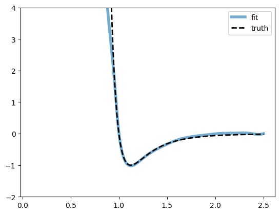
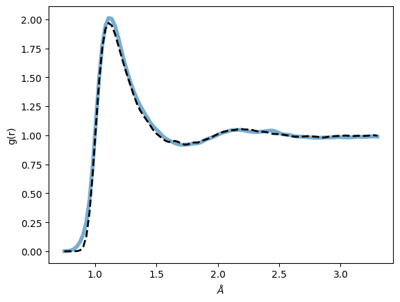

# Mdgrad Mini

**Mdgrad Mini** is a **simplified** version of the **Mdgrad** repository, focused on simulating the **Lennard-Jones (LJ) potential** for hydrogen using **Radial Distribution Function (RDF) data**.

This mini version retains only the essential code for LJ potential calculations, ensuring efficiency and easy integration into molecular dynamics workflows.

## Main Features  
- 🌡️ **Thermostat Control** – Adds an **Andersen thermostat** alongside the original **Nosé-Hoover**.  
- 🖥 **Graphical User Interface (GUI)** – Provides a user-friendly interface for improved usability.  

Currently GUI can be executed moving into **GUI** branch and Andersen by moving to **dev-andersen**. 

## Installation  

Clone the repository:  

```bash
git clone https://github.com/frathings/mdgrad_mini.git
```

To install the required dependencies, run:
```bash
pip install -r requirements.txt
```

## Folders 

Here, in the main branch, there is the **srcLJ** folder, which contains the core implementation.  

To run the full simulation, execute **LJ_notebook.ipynb**.  

### Expected Result:  




